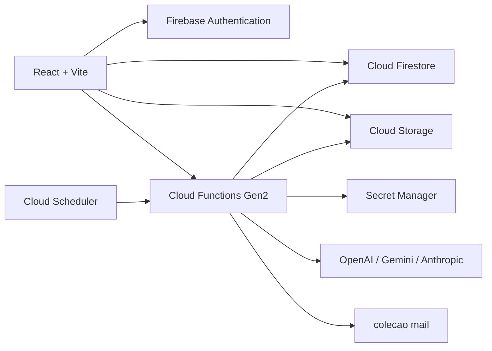

# Handoff tecnico - DG5 Content Intelligence

Snapshot preparado em 13/07/2026 para avaliacao, continuidade e eventual incorporacao do MVP pelo novo time de desenvolvimento.

## Entregaveis

- Repositorio: <https://github.com/guicz/dg5-content>
- Branch principal: `main`
- Tag de referencia: `handoff-2026-07-13`
- Ambiente publicado: <https://dg5-content-intelligence.web.app>
- Instrucoes de execucao: [README](../README.md)
- Inventario funcional: [FUNCIONALIDADES](./FUNCIONALIDADES.md)
- Modelo das colecoes: [MODELO-DE-DADOS](./MODELO-DE-DADOS.md)
- Amostra sem dados reais: [amostra-dados-anonimizada.json](./amostra-dados-anonimizada.json)
- Mensagem pronta de repasse: [MENSAGEM-DE-REPASSE](./MENSAGEM-DE-REPASSE.md)

O ZIP de handoff e gerado a partir de `git archive`. Por isso ele contem somente arquivos versionados e exclui automaticamente `.env.production.local`, segredos locais, logs, builds, caches e `node_modules`.

## Alerta de seguranca

O repositorio estava **publico** na verificacao de 13/07/2026. Nao adicionar dados reais de clientes, chaves, exports do Firestore ou arquivos internos enquanto ele permanecer publico. A recomendacao e torna-lo privado antes da continuidade com dados de producao.

O seed da tag de handoff esta anonimizado, mas o commit historico `6a10937` ainda contem os nomes usados durante o prototipo. O ZIP nao inclui o diretorio `.git` e, portanto, nao carrega esse historico. Para saneamento historico estrito, criar um repositorio privado novo a partir do ZIP em vez de clonar todo o historico atual.

Nenhum valor de segredo faz parte desta entrega. As verificacoes automatizadas nao encontraram padroes de chaves no estado atual nem no historico Git.

## Arquitetura



### Estrutura do codigo

| Caminho | Responsabilidade |
| --- | --- |
| `src/` | Frontend React, telas, componentes e integracao Firebase do navegador. |
| `functions/` | Backend Node.js 22, agentes de IA e rotina agendada. |
| `functions/index.js` | Entradas das quatro callable Functions e da Function agendada. |
| `functions/lib.js` | Fallbacks e revisao deterministica testavel. |
| `firestore.rules` | Autorizacao das colecoes Firestore. |
| `storage.rules` | Autorizacao, tipos e limite dos uploads. |
| `firestore.indexes.json` | Indice composto usado pelo alerta de agendamento. |
| `firebase.json` | Hosting, Functions, emuladores, regras, indices e cabecalhos. |
| `scripts/` | Inicializacao local e login da Firebase CLI no Windows. |
| `tests/` e `functions/tests/` | Testes deterministas do dominio e do backend. |

Nao existe pasta de backend REST separada nem servico Cloud Run autoral. As Functions sao de segunda geracao e o Firebase cria servicos Cloud Run gerenciados com os IDs `generatecontent`, `reviewcontent`, `generatebrandbrain`, `reviewcreative` e `checkmetascheduling`.

## Execucao local

Requisitos recomendados:

- Node.js 22;
- Corepack e pnpm;
- Java 21 para os emuladores;
- Firebase CLI autenticada somente para consultar ou publicar em um projeto real.

```powershell
git clone https://github.com/guicz/dg5-content.git
cd dg5-content
git checkout handoff-2026-07-13
corepack enable
pnpm install --frozen-lockfile
Copy-Item .env.example .env.local
pnpm test
pnpm --filter dg5-content-intelligence-functions test
pnpm build
```

Para desenvolvimento com emuladores, mantenha `VITE_USE_FIREBASE_EMULATORS=true` e execute em terminais separados:

```powershell
pnpm dev
pnpm emulators
```

No Windows, `./scripts/start-local.ps1` inicia os dois processos e grava os logs em `.runtime/`.

- Aplicacao: <http://localhost:5177>
- Emulator UI: <http://localhost:4000>

## Variaveis do frontend

Estao declaradas em `.env.example`. A configuracao web do Firebase e publica por natureza, mas nao deve ser confundida com chaves dos provedores de IA.

| Nome | Uso |
| --- | --- |
| `VITE_FIREBASE_API_KEY` | Chave publica da aplicacao web Firebase. |
| `VITE_FIREBASE_AUTH_DOMAIN` | Dominio do Firebase Authentication. |
| `VITE_FIREBASE_PROJECT_ID` | ID do projeto Firebase. |
| `VITE_FIREBASE_STORAGE_BUCKET` | Bucket usado pelo frontend. |
| `VITE_FIREBASE_MESSAGING_SENDER_ID` | Identificador publico do app Firebase. |
| `VITE_FIREBASE_APP_ID` | Identificador publico do app web. |
| `VITE_USE_FIREBASE_EMULATORS` | Ativa Auth, Firestore, Functions e Storage locais. |

## Segredos do backend

Os nomes estao em `functions/.secret.local.example`. Nao enviar valores por e-mail, chat, ZIP ou Git.

| Nome | Estado em producao em 13/07/2026 |
| --- | --- |
| `OPENAI_API_KEY` | Versao 2 vinculada as Functions. |
| `GEMINI_API_KEY` | Versao 2 vinculada as Functions. |
| `ANTHROPIC_API_KEY` | Versao 1 com sentinel `not-configured`; Claude nao esta ativo. |

Para um novo projeto Firebase, o time deve criar seus proprios segredos:

```powershell
firebase functions:secrets:set OPENAI_API_KEY
firebase functions:secrets:set GEMINI_API_KEY
firebase functions:secrets:set ANTHROPIC_API_KEY
```

## Estado do ambiente publicado

O ultimo deploy conhecido corresponde ao codigo funcional do commit `02ef300`. A tag de handoff acrescenta documentacao, scripts portaveis e seed anonimizado, mas nao foi reimplantada em producao para evitar uma mudanca operacional desnecessaria.

| Componente | Estado | Observacao |
| --- | --- | --- |
| Firebase Hosting | Publicado | Site `dg5-content-intelligence`; HTTP 200 verificado em 13/07/2026. |
| Google Authentication | Publicado | Interface e regras aceitam somente `@dg5.com.br`. |
| Firestore | Publicado | Banco padrao na regiao `southamerica-east1`. |
| Cloud Storage | Publicado | Arquivos em caminhos `clients/{clientId}/...`. |
| Firestore/Storage Rules | Publicado | Arquivos de regras incluidos no repositorio. |
| `generateContent` | Ativa | Callable Gen2, Node.js 22, 512 MiB. |
| `reviewContent` | Ativa | Callable Gen2, Node.js 22. |
| `generateBrandBrain` | Ativa | Callable Gen2, Node.js 22, 1 GiB. |
| `reviewCreative` | Ativa | Callable Gen2, Node.js 22, 1 GiB. |
| `checkMetaScheduling` | Ativa | Agendada diariamente as 08:00, fuso de Sao Paulo. |
| OpenAI | Ativa | Padrao economico `gpt-5-nano`. |
| Gemini | Ativa | Padrao `gemini-3.1-flash-lite`. |
| Anthropic | Inativa | Falta chave real. |
| Envio externo de e-mail | Inativo | A Function grava em `mail`, mas nao ha consumidor transacional configurado. |
| App Hosting | Nao utilizado | O projeto usa Firebase Hosting classico. |
| Cloud Run independente | Nao existe | Somente servicos gerenciados pelas Functions Gen2. |

## Usuarios e papeis para teste

### Producao

- Administrador bootstrap confirmado: `patricia@dg5.com.br`, por login Google. Nao compartilhar senha ou sessao.
- Uma nova conta Google `@dg5.com.br` recebe perfil `operator` no primeiro acesso.
- Nao existem contas de teste dedicadas para operador, designer e aprovador.
- Os papeis de designer e aprovador ainda nao alteram telas ou permissoes; criar contas artificiais daria uma falsa impressao de cobertura.

### Emulador local

- Usuario: `patricia@dg5.com.br`
- Senha local: `dg5-local-emulator`
- Essa credencial e criada somente no Auth Emulator e nao funciona em producao.

## O que esta somente local ou incompleto

- Seed demonstrativo e criacao automatica do workspace vazio.
- Login por e-mail/senha usado apenas no Auth Emulator.
- Contas e permissoes separadas para designer, aprovador operacional e aprovador final.
- Duas etapas reais de aprovacao interna.
- Feedback externo estruturado e candidatos de aprendizado.
- Historico imutavel de versoes do Brand Brain e dos conteudos.
- Consulta conversacional/RAG sobre toda a memoria do cliente.
- Importacao automatica de site e redes sociais.
- Planejamento mensal em lote e evidencia de agendamento no Meta.
- Publicacao automatica no Meta.
- Geracao automatica de criativos.
- Envio efetivo dos e-mails gravados na colecao `mail`.

## Riscos conhecidos antes de incorporar

1. As regras operacionais permitem leitura e escrita para qualquer usuario autenticado `@dg5.com.br`; falta isolamento por papel e cliente.
2. `fitScoreInternal` nao aparece na interface, mas fica no documento `contents` e pode ser lido por usuarios DG5 com acesso tecnico.
3. A numeracao do Brand Brain cresce, mas o mesmo documento e sobrescrito; nao ha trilha historica real.
4. `modelPerformance` e consultado pelo orquestrador, mas ainda nao recebe agregacao automatica de desempenho.
5. A interface aceita upload de PDF criativo, mas a revisao visual do backend aceita apenas imagens.
6. O repositorio publico exige saneamento continuo e nao deve receber materiais reais.

## Acessos que precisam ser concedidos separadamente

- Permissao no projeto Firebase/GCP `dg5-content-intelligence` para quem mantiver producao.
- Acesso ao faturamento somente para os responsaveis financeiros.
- Acesso de deploy a Hosting, Functions Gen2, Cloud Run gerenciado, Artifact Registry, Scheduler, Firestore, Storage e Secret Manager.
- Acesso aos paineis OpenAI e Gemini somente se o time tambem assumir faturamento, rotacao e limites das APIs.

O acesso ao GitHub nao concede acesso ao Firebase nem aos valores do Secret Manager.

## Sequencia recomendada para o novo time

1. Tornar o repositorio privado ou criar um repositorio privado limpo a partir do ZIP.
2. Clonar a tag de handoff e executar testes/build sem alterar producao.
3. Criar um projeto Firebase de desenvolvimento separado.
4. Importar a amostra anonimizada ou usar o seed local.
5. Auditar regras e implementar papeis antes de adicionar novos usuarios.
6. Executar um fluxo completo com cliente ficticio.
7. Somente depois decidir quais modulos serao reaproveitados, refatorados ou reconstruidos.

## Prints

Nao foram incluidos porque o repositorio e o ambiente de teste estao disponiveis. O ambiente publicado deve ser usado como referencia visual; prints ficariam rapidamente desatualizados.
