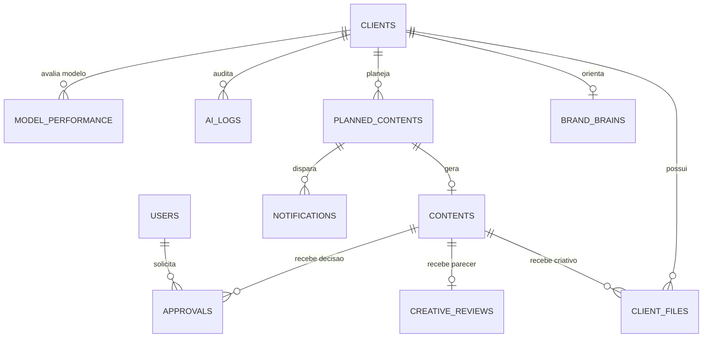

# Modelo de dados Firestore

O Firestore usa colecoes no nivel raiz. Os relacionamentos sao feitos por IDs armazenados nos documentos; nao existem subcolecoes por cliente no MVP.

## Relacionamentos principais



## Colecoes em uso

| Colecao | Escrita principal | Campos relevantes | Relacoes |
| --- | --- | --- | --- |
| `users` | Frontend no primeiro login | `name`, `email`, `photoURL`, `role`, `updatedAt` | ID igual ao UID do Firebase Auth. |
| `clients` | Tela Clientes | `name`, `segment`, `status`, `channels[]`, `responsibleName`, `responsibleEmail`, `notes`, `brandHealth` | Referenciada por `clientId`. |
| `clientFiles` | Upload do frontend | `clientId`, `contentId`, `name`, `type`, `size`, `kind`, `storagePath`, `downloadURL`, `createdAt` | `kind` e `knowledge` ou `creative`. |
| `brandBrains` | Tela Brand Brain | `clientId`, `status`, `version`, `tone`, `positioning`, `audience`, `preferences`, `restrictions`, `bannedWords`, `qualityCriteria`, `strategicSummary`, `learnings` | Um documento atual por cliente. |
| `plannedContents` | Tela Planejamento | `clientId`, `title`, `channel`, `format`, `objective`, `publishDate`, `priority`, `status`, `campaign`, `editorialLine`, `responsibleName`, `responsibleEmail`, `requiresMetaScheduling`, `metaScheduled` | Origem de `contents`. |
| `contents` | Estudio e revisoes | `clientId`, `plannedContentId`, `title`, `channel`, `format`, `text`, `artSuggestion`, `status`, `origin`, `model`, `fitScoreInternal`, `fitState`, `guidance[]`, `creativeFileId` | Um documento atual por item planejado no fluxo existente. |
| `creativeReviews` | Tela Revisoes | `clientId`, `contentId`, `status`, `summary`, `findings[]`, `model` | Parecer atual do criativo. |
| `approvals` | Tela Revisoes | `clientId`, `contentId`, `decision`, `comment`, `stage`, `updatedAt` | Historico de decisoes; hoje `stage` e `final`. |
| `notifications` | Function agendada | `type`, `status`, `clientId`, `plannedContentId`, `title`, `message`, `responsibleEmail`, `publishDate`, `createdAt` | ID deterministico `meta-{plannedContentId}-{date}`. |
| `aiGateway` | Painel Admin | Provedor/modelo de cada tarefa e `routingMode` | Documento unico `default`. |
| `aiLogs` | Backend Admin SDK | `task`, `clientId`, `provider`, `model`, `reason`, `mode`, `requestedBy`, `durationMs`, `metadata`, `createdAt` | Somente leitura administrativa pelas regras. |
| `modelPerformance` | Preparado para backend/admin | `clientId`, `task`, `provider`, `model`, `avgFitScore` | Consultado pelo orquestrador; agregacao ainda ausente. |
| `mail` | Function agendada | `to[]`, `message.subject`, `message.text` | Aguarda consumidor/extensao de e-mail. |

## Colecoes reservadas, sem fluxo completo

As regras ja citam estas colecoes, mas o frontend atual nao oferece um modulo funcional para elas:

| Colecao | Uso previsto |
| --- | --- |
| `onboardings` | Entrevistas e formularios de onboarding. |
| `plans` | Entidade agregadora de planejamento mensal/campanha. |
| `feedbacks` | Retorno externo manual do cliente. |
| `learningCandidates` | Sugestoes de aprendizado para validacao interna. |

## Tipos e convencoes

- IDs sao strings; varios fluxos usam `crypto.randomUUID()`.
- `clientId`, `plannedContentId` e `contentId` sao referencias logicas, nao `DocumentReference`.
- `createdAt` e `updatedAt` sao `Timestamp` do Firestore em producao.
- `publishDate` e string local no formato `YYYY-MM-DD`.
- Arrays sao usados para canais, orientacoes, achados e destinatarios.
- `fitScoreInternal` e numero de 0 a 100; a interface mostra apenas `fitState` e `guidance`.

## Caminhos do Storage

```text
clients/{clientId}/knowledge/{uuid}-{safeFileName}
clients/{clientId}/creative/{uuid}-{safeFileName}
```

- Limite das regras: menos de 25 MB por upload.
- Tipos aceitos: imagens, PDF, `application/vnd.*` e texto.
- A revisao visual da Function impõe limite adicional de 12 MB e exige `image/*`.

## Indice composto

`plannedContents` usa um indice para a rotina de Meta:

1. `requiresMetaScheduling` ascendente;
2. `metaScheduled` ascendente;
3. `publishDate` ascendente.

## Regras atuais

- `aiGateway`: somente administrador.
- `aiLogs`: leitura de administrador; escrita bloqueada para clientes SDK.
- Colecoes operacionais: leitura/escrita para qualquer conta autenticada `@dg5.com.br`.
- Storage: leitura/escrita para qualquer conta autenticada `@dg5.com.br` dentro de `clients/`.

Antes de adicionar mais usuarios, criar regras por papel, atribuicao e cliente.
